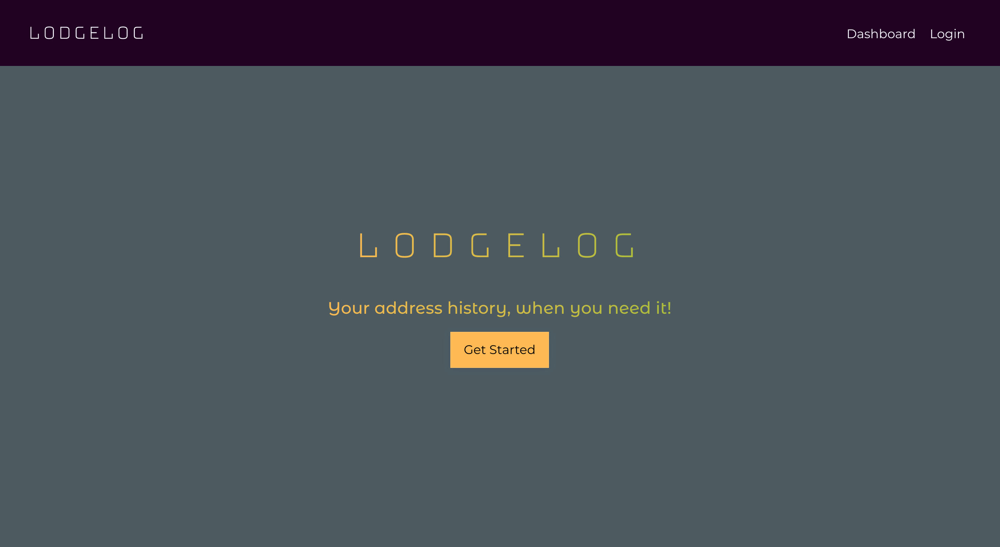
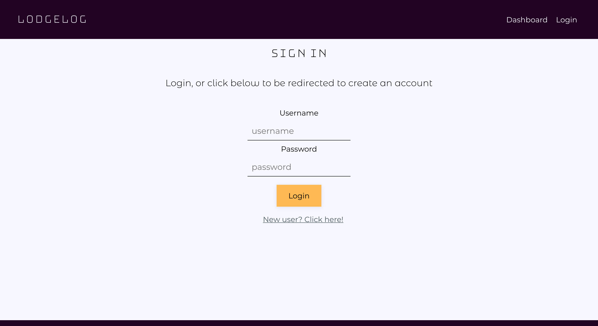
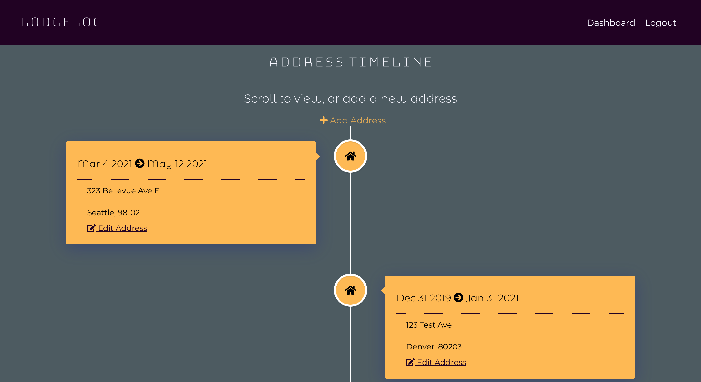

# LodgeLog

## Summary:

LodgeLog is a webapp created using the LodgeLog-API I build, which you can view [here](https://github.com/tatia-burdett/lodgelog-api). LodgeLog allows users to create an account and log in to view a timeline of their personal address history. Users can POST new addresses, and PATCH the to_date of each address to update their current address. All addresses are sorted to be viewed in chronological order, with the most recent address at the top. [React Vertical Timeline](https://stephane-monnot.github.io/react-vertical-timeline/#/) package was used to help style and create the timeline effect. 

## Tech Details:

This project was made with a server-side program I built.
* [LodgeLog-API](https://github.com/tatia-burdett/lodgelog-api)

Details:
* CSS
* React
* PostgreSQL
* Node.js
* Express

## See it live:

[Live link](https://lodgelog-app-tatia-burdett.vercel.app/)

## Screenshots

### Landing Page

### Login Page

### Dashboard / Timeline
